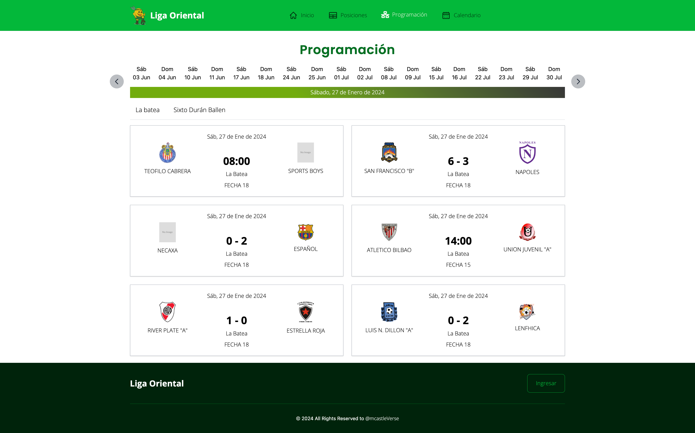
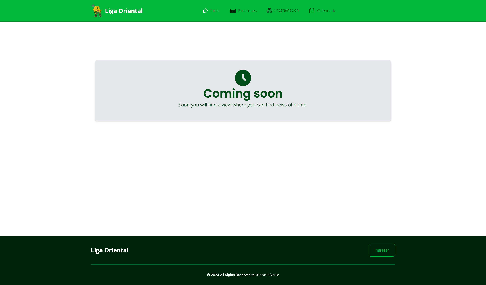

<div align="center">
 

### SportsBetting page
This project is created for a technical test and was generated with [Angular CLI](https://github.com/angular/angular-cli) version 17.2.0.
</div>

<div align="center">
    <a href="#" target="_blank">
        Preview
    </a>
    <span>&nbsp;✦&nbsp;</span>
    <a href="#-getting-started">
        Getting Started
    </a>
    <span>&nbsp;✦&nbsp;</span>
    <a href="#-commands">
        Commands
    </a>
    <span>&nbsp;✦&nbsp;</span>
    <a href="#-license">
        License
    </a>
    <span>&nbsp;✦&nbsp;</span>
    <a href="https://twitter.com/MiguelA66750525">
        Twitter
    </a>
</div>

<p></p>

<div align="center">


</div>

<!-- > [!WARNING]
> This page is not official. The official page is [**premiosesland.com**](https://premiosesland.com/). -->

## 🛠️ Stack

- [**Angular**](https://astro.build/) - The web framework for cAngular is a development platform, built on TypeScript.
- [**Typescript**](https://www.typescriptlang.org/) - JavaScript with syntax for types.
- [**Tailwindcss**](https://tailwindcss.com/) - A utility-first CSS framework for rapidly building custom designs.
- [**Google fonts**](https://fontsource.org/) - Self-host fonts in neatly bundled in CDN.

## 🚀 Getting Started

1. [Fork](https://github.com/McastilloA/sportsBetting/fork) or clone this repository.

```bash
git clone https://github.com/McastilloA/sportsBetting.git
```

2. Install the dependencies:

- You can use ***NPM***, which is installed by default when you download [NodeJS](https://nodejs.org/en).

<!-- ```bash
# Install bun for MacOS, WSL & Linux:
curl -fsSL https://bun.sh/install | bash

# Install bun for Windows:
powershell -c "iwr bun.sh/install.ps1|iex"

# Install with bun:
bun install
``` -->
```bash
# Install npm globally if you don't have it:
npm install -g npm
```

- or you can use [pnpm](https://pnpm.io):

```bash
# Install pnpm globally if you don't have it:
npm install -g pnpm

# Install dependencies:
pnpm install

# (Optional) You can pin the version of pnpm used on 
# your project using the following command:
corepack use pnpm
```

3. Run the development server:

```bash
# Run with bun:
npm start

# Run with pnpm:
pnpm start
```

4. Open [**http://localhost:4200**](http://localhost:4200/) with your browser to see the result 🚀

<!-- ### 🤝 Contributing

<a href="https://github.com/McastilloA/sportsBetting/graphs/contributors">
  
</a> -->

## 🤩 Application functionality 

Sections of list dates and list de matches the module **programming** 



Components the module **home** 





## 🧞 Commands

|     | Command          | Action                                        |
| :-- | :--------------- | :-------------------------------------------- |
| ⚙️  | `start` | Starts local dev server at `localhost:4200`.  |
| ⚙️  | `build`          | The build artifacts will be stored in the `dist/` directory.               |
| ⚙️  | `test`           | execute the unit tests via [Karma](https://karma-runner.github.io).      |
| ⚙️  | `e2e`            | execute the end-to-end tests via a platform of your choice. To use this command, you need to first add a package that implements end-to-end testing capabilities.                          |
| ⚙️  | `preview`        | Preview your build locally, before deploying. |


## Code scaffolding

Run `ng generate component component-name` to generate a new component. You can also use `ng generate directive|pipe|service|class|guard|interface|enum|module`.


## Further help

To get more help on the Angular CLI use `ng help` or go check out the [Angular CLI Overview and Command Reference](https://angular.io/cli) page.


## 🔑 License

[MIT](#) - Created by [**@mclasteVerse*](https://github.com/McastilloA).

## ✅ Por hacer...

- [ ] Mejorar diseño de la página
- [ ] Construir módulos Home, Posiciones, Calenadrio, Login, Register
- [ ] Revisar responsive de toda la página
